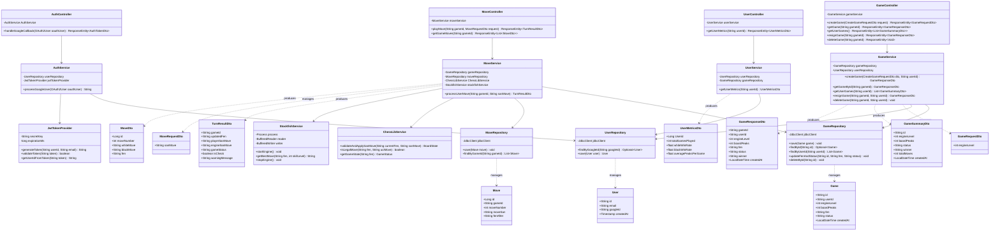

```mermaid 
classDiagram
    direction TB

    %% --- CONTROLLERS ---
    class GameController {
        -GameService gameService
        +createGame(CreateGameRequestDto request) ResponseEntity~GameRequestDto~
        +getGame(String gameId) ResponseEntity~GameResponseDto~
        +getUserGames() ResponseEntity~List~GameSummaryDto~~
        +resignGame(String gameId) ResponseEntity~GameResponseDto~
        +deleteGame(String gameId) ResponseEntity~Void~
    }

    class MoveController {
        -MoveService moveService
        +playMove(String gameId, MoveRequestDto request) ResponseEntity~TurnResultDto~
        +getGameMoves(String gameId) ResponseEntity~List~MoveDto~~
    }

    class AuthController {
        -AuthService AuthService
        +handleGoogleCallback(OAuth2User oauthUser) ResponseEntity~AuthTokenDto~
    }

    class UserController {
        -UserService userService
        +getUserMetrics(String userId) ResponseEntity~UserMetricsDto~
    }

    %% --- SERVICES ---
    class GameService {
        -GameRepository gameRepository
        -UserRepository userRepository
        +createGame(CreateGameRequestDto dto, String userId) GameResponseDto
        +getGameById(String gameId) GameResponseDto
        +getUserGames(String userId) List~GameSummaryDto~
        +resignGame(String gameId, String userId) GameResponseDto
        +deleteGame(String gameId, String userId) void
    }

    class MoveService {
        -GameRepository gameRepository
        -MoveRepository moveRepository
        -ChessLibService ChessLibService
        -StockfishService stockfishService
        +processUserMove(String gameId, String sanMove) TurnResultDto
    }

    class ChessLibService {
        +validateAndApplySanMove(String currentFen, String sanMove) BoardState
        +isLegalMove(String fen, String uciMove) boolean
        +getGameState(String fen) GameStatus
    }

    class StockfishService {
        -Process process
        -BufferedReader reader
        -BufferedWriter writer
        +startEngine() void
        +getBestMove(String fen, int skillLevel) String
        +stopEngine() void
    }

    class AuthService {
        -UserRepository userRepository
        -JwtTokenProvider jwtTokenProvider
        +processGoogleUser(OAuth2User oauthUser) String
    }

    class UserService {
        -UserRepository userRepository
        -GameRepository gameRepository
        +getUserMetrics(String userId) UserMetricsDto
    }

    class JwtTokenProvider {
        -String secretKey
        -long expirationMs
        +generateToken(String userId, String email) String
        +validateToken(String token) boolean
        +getUserIdFromToken(String token) String
    }

    %% --- REPOSITORIES (JdbcClient Data Access) ---
    class GameRepository {
        -JdbcClient jdbcClient
        +save(Game game) void
        +findById(String id) Optional~Game~
        +findByUserId(String userId) List~Game~
        +updateFenAndStatus(String id, String fen, String status) void
        +deleteById(String id) void
    }

    class MoveRepository {
        -JdbcClient jdbcClient
        +save(Move move) void
        +findByGameId(String gameId) List~Move~
    }

    class UserRepository {
        -JdbcClient jdbcClient
        +findByGoogleId(String googleId) Optional~User~
        +save(User user) User
    }

    %% --- DATA MODELS & DTOS ---
    class Game {
        +String id
        +String userId
        +int engineLevel
        +int boardPeaks
        +String fen
        +String status
        +LocalDateTime createdAt
    }

    class Move {
        +Long id
        +String gameId
        +int moveNumber
        +String moveSan
        +String fenAfter
    }

    class User {
        +String id
        +String email
        +String googleId
        +Timestamp createdAt
    }

    class UserMetricsDto {
        +Long Userid
        +int totalGamesPlayed
        +float whiteWinRate
        +float blackWinRate
        +float averagePeaksPerGame
    }

    class TurnResultDto {
        +String gameId
        +String updatedFen
        +String playerSanMove
        +String engineSanMove
        +String gameStatus
        +boolean isCheck
        +String warningMessage
    }

    class GameResponseDto {
        +String gameId
        +String userId
        +int engineLevel
        +int boardPeaks
        +String fen
        +String status
        +String winner
        +LocalDateTime createdAt
    }

    class GameRequestDto {
        +int engineLevel
    }

    class GameSummaryDto {
        +String id
        +int engineLevel
        +int boardPeaks
        +String status
        +String winner
        +int totalMoves
        +LocalDateTime createdAt
    }

    class MoveRequestDto {
        +String sanMove
    }

    class MoveDto {
        +Long id
        +int moveNumber
        +String whiteMove
        +String blackMove
        +String fen
    }

    %% --- RELATIONSHIPS & DEPENDENCIES ---
    GameController --> GameService
    MoveController --> MoveService
    AuthController --> AuthService
    UserController --> UserService

    GameService --> GameRepository
    GameService --> UserRepository
    MoveService --> GameRepository
    MoveService --> MoveRepository
    MoveService --> ChessLibService
    MoveService --> StockfishService

    AuthService --> UserRepository
    AuthService --> JwtTokenProvider
    UserService --> UserRepository

    GameRepository ..> Game : manages
    MoveRepository ..> Move : manages
    UserRepository ..> User : manages

    UserService ..> UserMetricsDto: produces
    
    GameService ..> GameRequestDto : manages
    GameService ..> GameSummaryDto : produces
    GameService ..> GameResponseDto : produces
    MoveService ..> TurnResultDto : produces
    MoveService ..> MoveRequestDto : manages
    MoveService ..> MoveDto : produces
```